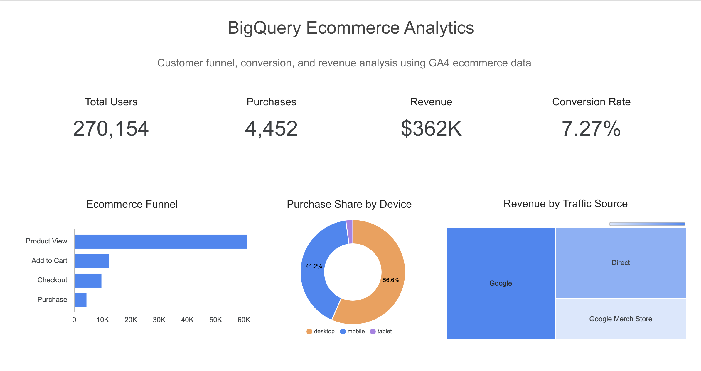

# BigQuery Ecommerce Analytics

Ecommerce customer journey and revenue analysis using GA4 data in BigQuery.

## Project Overview

In this project, I analyzed ecommerce user behavior using the Google Analytics 4 public ecommerce dataset.

The analysis focused on:
- funnel conversion
- traffic source quality
- device performance
- product engagement
- revenue performance

## Dataset

Google Analytics 4 sample ecommerce dataset available in BigQuery.

Dataset documentation:  
https://developers.google.com/analytics/bigquery/web-ecommerce-demo-dataset

```sql
bigquery-public-data.ga4_obfuscated_sample_ecommerce
```

## Tools Used

- BigQuery
- SQL
- Looker Studio

## Key Insights

- The dataset contains over 4.2M events and 270k users
- Only 7.2% of users who viewed a product completed a purchase
- The biggest funnel drop-off happened between product view and add-to-cart
- Mobile users had slightly higher conversion rates than desktop users
- Google generated the highest total revenue ($104k+)
- Direct traffic showed stronger purchase intent and higher conversion quality
- Average order value stayed stable across traffic sources (~$80)
- Some products received high engagement but low purchase conversion

## Analysis Included

1. Dataset Overview  
2. Funnel Analysis  
3. Device Performance Analysis  
4. Traffic Source Analysis  
5. Product Performance Analysis  
6. Revenue Analysis  

## Project Structure

```text
bigquery-ecommerce-analytics/
│
├── sql/
├── assets/
└── README.md
```

## Dashboard

The dashboard includes:
- funnel conversion analysis
- device performance
- traffic source performance
- revenue overview
- product insights

## Dashboard Preview



## Interactive Dashboard

View the interactive Looker Studio dashboard here:

[Open Dashboard](https://datastudio.google.com/reporting/26f3c177-d92b-42e3-81b6-96d4bbc75b5c)
